# Booking App

A sleek and modern Flutter-based booking application designed with smooth navigation, elegant UI, and Firebase-powered authentication.

---

## Features

- Authentication with google

- State Management

- Save data in local DB
---
## Tech Stack

- Flutter

- Riverpod

- Firebase Auth

- Cloud Firestore

- Sqflite
---

## Screenshots

<div align="center">
  
  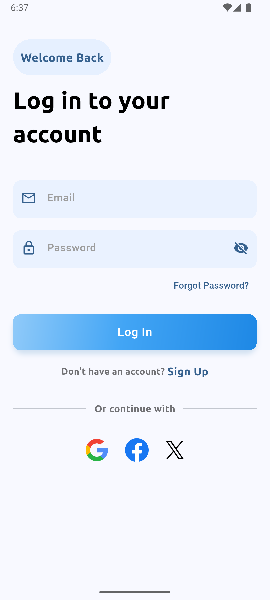
  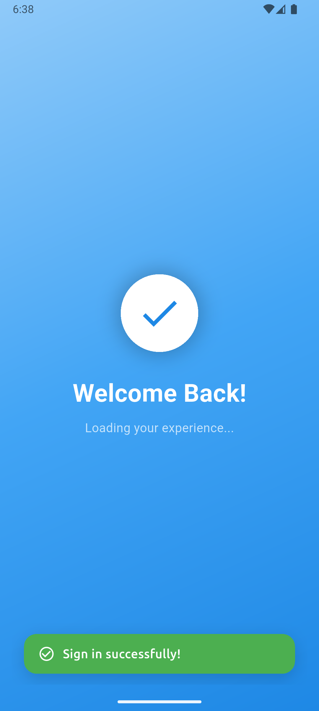
  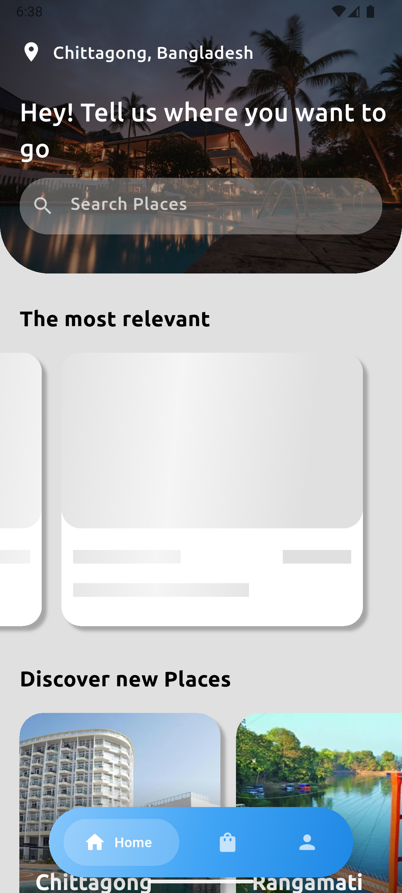
  
  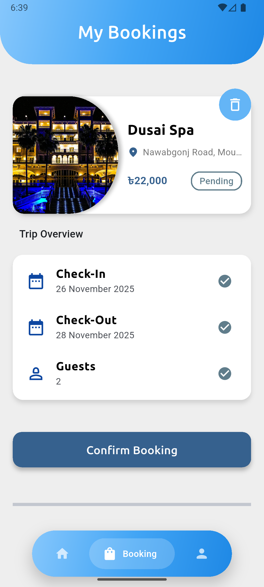
  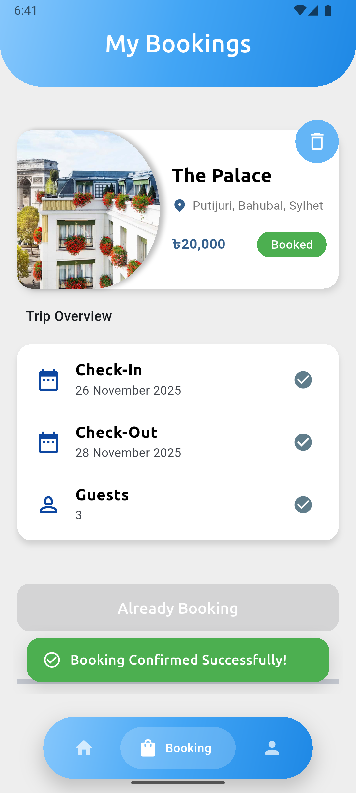
  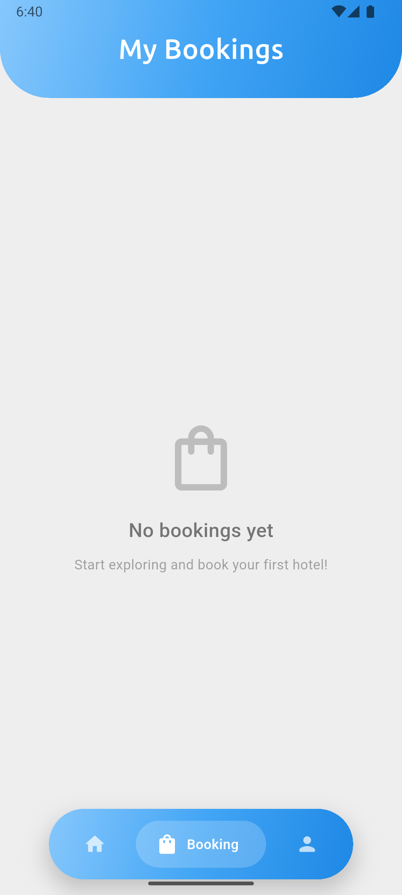
  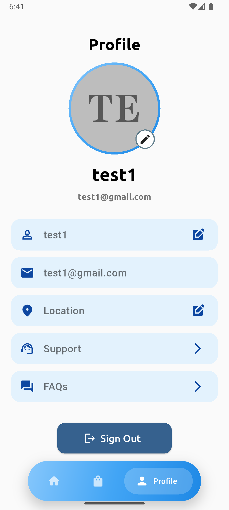
  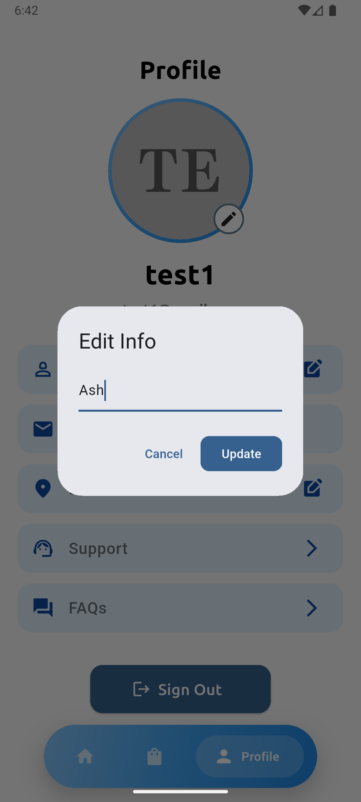
  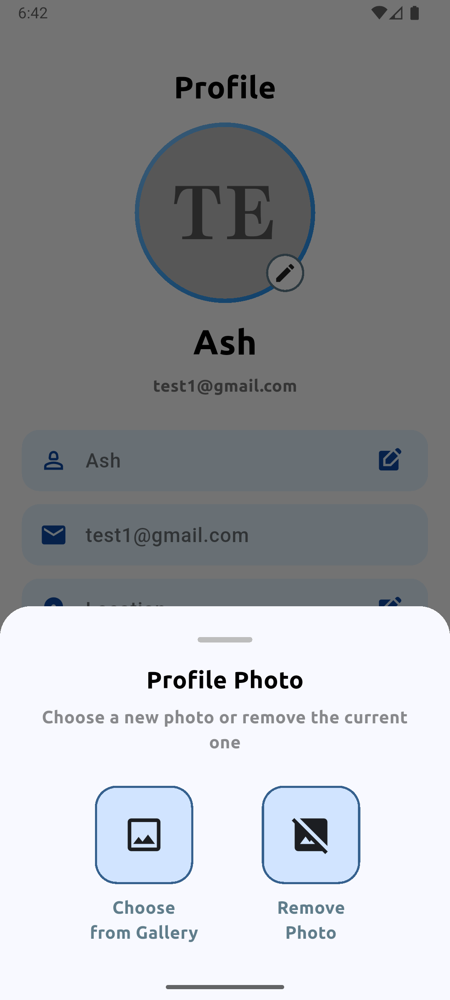
  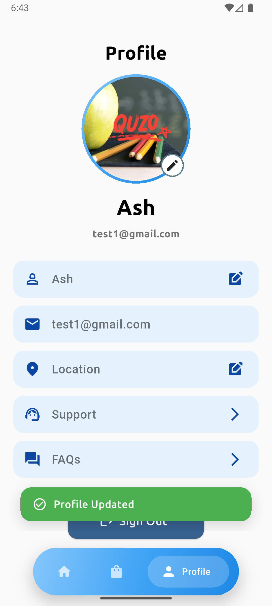
  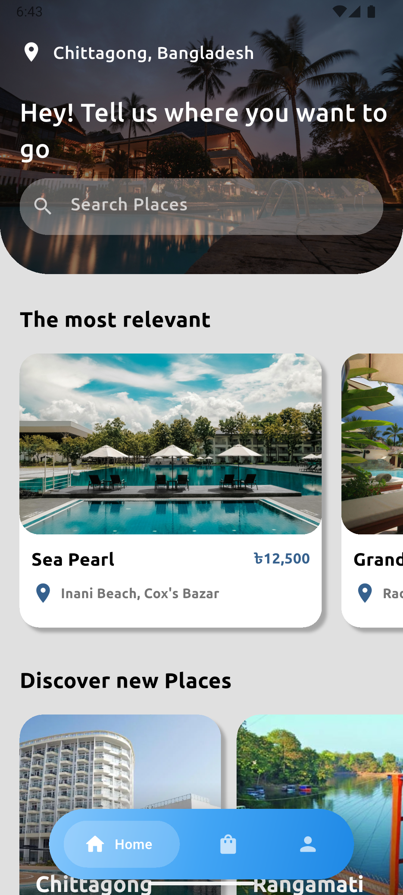
</div>

---

## Packages that are used
```sh
  google_fonts: ^6.3.2
  shimmer: ^3.0.0
  google_nav_bar: ^5.0.7
  firebase_core: ^4.2.1
  firebase_auth: ^6.1.2
  random_string: ^2.3.1
  google_sign_in: ^6.2.2
  flutter_riverpod: ^3.0.3
  cloud_firestore: ^6.1.0
  intl: ^0.20.2
  image_picker: ^1.2.1
  sqflite: ^2.4.2
  uuid: ^4.5.2
````
---

## Installation
```sh
git clone https://github.com/as-morat/Hotel-Booking_app
cd booking_app
flutter pub get
flutter run
```